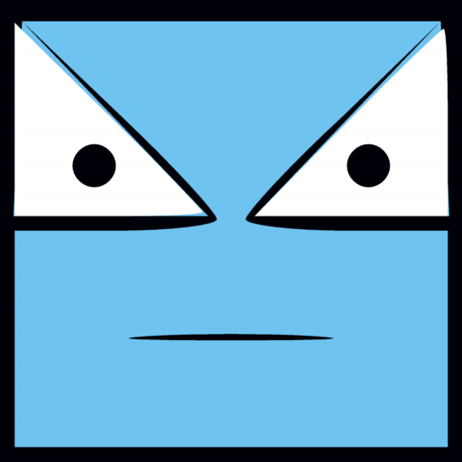

#   Double Ball Zero

Double Ball Zero is a 2D Android mobile game.

## ℹ️ Description

Double Ball ! Red and Green ! Bad and Good !  
Go for good green ball, avoid bad red ball !

- How To Play ?
  - Tap Where you want to move.
  - Do not get hit by the red ball.
  - Get hit by the green ball.

## 🚀 Development
- ⚙️ Engine: [**Clickteam Fusion 2.5 Developer**](https://www.clickteam.com/clickteam-fusion-2-5-developer)
  - Build: [**Android / OUYA Export Module**](https://www.clickteam.com/android-export-module)

## 📄 License
&copy; Ambratolm 2018.